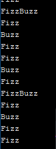
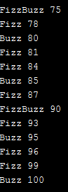
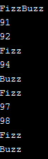
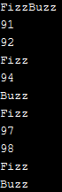
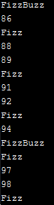

# Coding Challenge 1 - FizzBuzz
Challenge: Write a program that prints the numbers from 1 to 100 and for multiples of '3' print "Fizz" instead of the number, for the multiples of '5' print "Buzz" instead of the number and for multiples of both '3' and '5' print "FizzBuzz".
## Gearoid
```
#include <iostream>
#include <string>

using namespace std;

string fizzbuzz(int in){
    string result = "";
    if(in%3==0)
        result += "Fizz";
    if(in%5==0)
        result += "Buzz";
    return result;
}

int main()
{
    for(int i = 1; i < 100; i++){
        string current = fizzbuzz(i);
        if(current != "")
            cout<<fizzbuzz(i)+"\n";    
    }
    
    return 0;
}
```
Wall time taken: \~0.2ms
Sample Output: 

**Pros**
1. Simple
1. Uses functional logic

**Cons**
1. Doesn't actually print "the numbers from 1 to 100"
1. Variable names are vague - "in", "current"

## Ian
```
// FizzBuzz.cpp : This file contains the 'main' function. Program execution begins and ends there.
//------------------------------------------------ -
//C++ Coding Challenge Round 1 - Fizz Buzz
//------------------------------------------------ -
//Write a program that prints the numbers from 1 to 100 and for multiples of '3' print "Fizz" instead of the number, for the multiples of '5' print "Buzz" instead of the number and for multiples of both '3' and '5' print "FizzBuzz".
//
//Points will mostly be awarded for performance, generality, readability, comments(if needed) and dependencies(the fewer the better).

#include <iostream>

/// <summary>Use to identify if a number is divisable by another number.</summary>
/// <param name="number">Number to be divided.</param name>
/// <param name="divisor">Indicates which number we're checking the multiple of.</param name>
/// <returns>True if the number is divisable by the divisor, else False.</returns>
bool checkDivisible(int number, int divisor)
{
    if (number % divisor == 0)
        return true;
    else
        return false;
}


int main()
{
    for (int i = 0; i <= 100; i++)
    {
        
        bool isFizz = checkDivisible(i, 3);
        bool isBuzz = checkDivisible(i, 5);
        bool isFizzBuzz = isFizz && isBuzz;

        if (isFizzBuzz)
            std::cout << "FizzBuzz " <<  i << std::endl;
        else if (isBuzz)
            std::cout << "Buzz " << i << std::endl;
        else if (isFizz)
            std::cout << "Fizz " << i << std::endl;
    }
        
}
```
Wall time taken: \~0.25ms
Sample Output: 

**Pros**
1. Simple
1. Uses functional logic
1. Good use of comments
1. Condition-Variable combos read like English
1. Lightweight - only has 1 dependency

**Cons**
1. Doesn't actually print "the numbers from 1 to 100", also prints "Fizz $number" when the result should be "Fizz"
1. `return 0;` doesn't need to be included by default, but it is always better to be explicit

## Jarek
```
#include <iostream>

int main()
{
    for(int i = 1; i <= 100; ++i)
    {
        std::string msg = "";
        msg.append((i % 3 == 0) ? "Fizz" : "");
        msg.append((i % 5 == 0) ? "Buzz" : "");
        msg.empty() ? printf("%i\n", i) : printf("%s\n", msg.c_str());
    }
}
```
Wall time taken: \~0.5ms
Sample Output: 

**Pros**
1. Simple
1. Solves the challenge
1. Lightweight - only has 1 dependency

**Cons**
1. No comments
1. Low readability
1. `return 0;` doesn't need to be included by default, but it is always better to be explicit

## Trevor
```
/*
FizzBuzz.cpp - Trevor
*/
#include <iostream>
using namespace std;

int main() {
    int num = 1;

    while (num < 101) {
        if (((num%3)==0) && ((num%5) == 0)) {     //Check if value is divisible by 3 & 5
            cout << "FizzBuzz" << endl;
        } else if ((num%3) == 0) {                //Check if value is divisible by 3
            cout << "Fizz" << endl;
        } else if ((num%5) == 0) {                //Check if valueis divisible by 5
            cout << "Buzz" << endl;
        } else {
            cout << num << endl;
        }

        num++;
    }
}
```
Wall time taken: \~0.5ms
Sample Output: 

**Pros**
1. Simple
1. Lightweight - only has 1 dependency
1. Solves the challenge

**Cons**
1. Readability relies on comments where variables could've been used
1. `return 0;` doesn't need to be included by default, but it is always better to be explicit

## Matt
```
// FizzBuzz.cpp : This file contains the 'main' function. Program execution begins and ends there.
//

#include <iostream>
//Just a few dependencies for the parallel version + time : - )
#include <thread>
#include <atomic>
#include <ctime>
#include <iomanip>

//Helper Functions:
void Fizz(int);
void Buzz(int);

//Condition Variables:
std::atomic<bool> fizz = 0; //indicates fizz has not triggered
std::atomic<bool> buzz = 0; //indicates buzz has not triggered

int main()
{
	int n = 100; //number to fizzbuzz up to
	char linear_or_parallel = 'y'; //y for linear, n for parallel

	//User Inputs desired n and whether parallel or linear:
	std::cout << "Input desired number to fizz to: ";
	std::cin >> n;
	std::cout << "Parallel (y/n): ";
	std::cin >> linear_or_parallel;
	std::cout << "\n";

	//starting a timer:
	std::clock_t c_start = std::clock();
	auto t_start = std::chrono::high_resolution_clock::now();

	//Linear Implementation - Very Complex.
	if (linear_or_parallel != 'y') {
		int ifizz, ibuzz;
		for (int i = 0; i <= n - 1; i++) {
			ifizz = i % 3;
			ibuzz = i % 5;
			if (ifizz && ibuzz == 0) {
				std::cout << "FizzBuzz";
			}
			else if (ifizz == 0) {
				std::cout << "Fizz";
			}
			else if (ibuzz == 0) {
				std::cout << "Buzz";
			}
			else std::cout << i;

			std::cout << '\n';
		}
	}
	else {
		//Parallel Implementation - Very Simple.
		for (int i = 0; i <= n - 1; i++) {
			std::thread t1(Fizz, i);	//check for fizz
			std::thread t2(Buzz, i);	//check for buzz (in parallel)
			//finish checks:
			t1.join();
			t2.join();
			//if checks didnt fizz or buzz, print number, etc.:
			if (fizz && buzz)
			{
				std::cout << "FizzBuzz";
			}
			else if (fizz == 1)
			{
				std::cout << "Fizz";
			}
			else if (buzz == 1)
			{
				std::cout << "Buzz";
			}
			else
			{
				std::cout << i;
			}
			std::cout << '\n';
			//reset the flags for next loop
			fizz = 0;
			buzz = 0;
		}
	}

	//checking the time taken:
	std::clock_t c_end = std::clock();
	auto t_end = std::chrono::high_resolution_clock::now();
	std::cout << std::fixed << std::setprecision(2) << "\nCPU time used: "
		<< 1000.0 * (c_end - c_start) / CLOCKS_PER_SEC << " ms\n"
		<< "Wall clock time passed: "
		<< std::chrono::duration<double, std::milli>(t_end - t_start).count()
		<< " ms\n";
}

void Fizz(int i) {
	if (i % 3 == 0) {
		fizz = 1; //update the global atomic flag bool
	}
		
}

void Buzz(int i) {
	if (i % 5 == 0) {
		buzz = 1; //update the global atomic flag bool
	}	
}


// Run program: Ctrl + F5 or Debug > Start Without Debugging menu
// Debug program: F5 or Debug > Start Debugging menu

// Tips for Getting Started: 
//   1. Use the Solution Explorer window to add/manage files
//   2. Use the Team Explorer window to connect to source control
//   3. Use the Output window to see build output and other messages
//   4. Use the Error List window to view errors
//   5. Go to Project > Add New Item to create new code files, or Project > Add Existing Item to add existing code files to the project
//   6. In the future, to open this project again, go to File > Open > Project and select the .sln file
```
Wall time taken: \~0.5ms
Sample Output: 

**Pros**
1. Uses functional logic
1. Implements parallelization
1. Well commented
1. Solves the challenge
1. Generalises the input - it could be any number, rather than just 100

**Cons**
1. Parallel implementation is wholly worse than the sequential solution without even getting better for larger numbers
1. Doesn't have a summary comment section at the top of the code
1. Uses 5 dependencies, where only 2 are actually needed
1. Code itself has low readability
1. Variables are vague - "n", "ifizz", "ibuzz"
1. `return 0;` doesn't need to be included by default, but it is always better to be explicit
1. Only two threads are generated, and they only access one variable each - these variables do not need to be atomic
1. The whole "fizz buzz" conditional logic could be put into a function